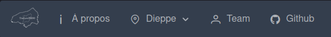
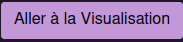
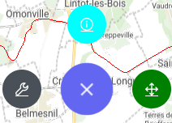
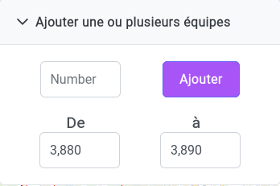
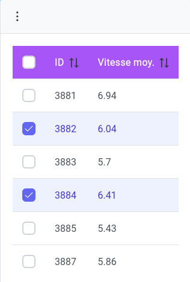
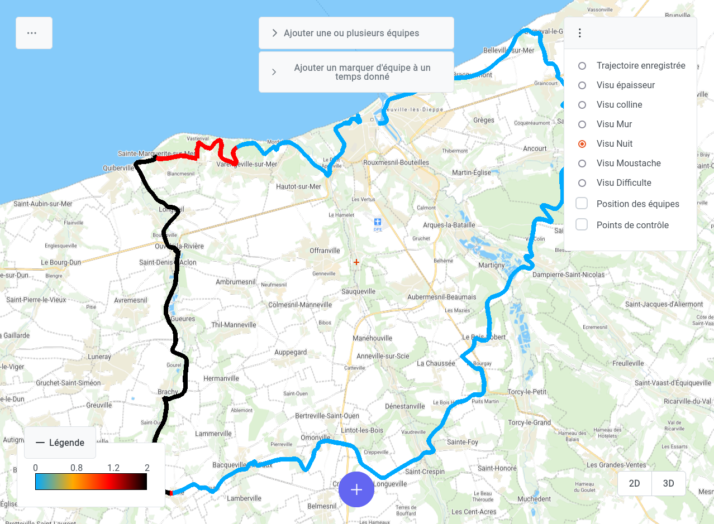
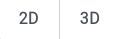

# Guide d'utilisation

Apres avoir cloner, build et lancer le projet, rendez vous à l'adresse http://localhost:8500/home

*Sur des ordinateurs performants, le build peut prendre jusque 2 minutes et le lancement peut prendre quelques minutes, le temps que les briques se connectent correctement entre elles.*

## Manipulation de l'application
Vous pouvez naviguer en utilisant le bandeau horizontal.

Les boutons vous ammènnent vers :
- La page pour en apprendre plus sur le contexte du projet,
- Les informations receuillies par l'Oxfam,
- Notre équipe,
- Le GitHub du projet

Pour atteindre le coeur de notre application, cliquez sur le bouton violet "Aller à la Visualisation"

## La carte interactive

### Premiers pas

Vous arrivez devant une carte de la région concernée, et une trace du parcours de la course.

Le bouton qui vous donnera le plus d'information est le gros "+" en bas de l'écran. Vous aurez alors le choix entre 3 boutons secondaires.

De gauche à droite :
- Le bouton Contrôles, qui vous explique comment naviguer sur la carte,
- Le bouton Tutoriel, qui dcrit comment utiliser les panneaux utilisateurs. Nous vous recommandons fortement de le lire attentivement.
- Le Bonton Recentrage, qui permet de réinitialiser la position de la carte, si vous êtes perdus !

*Si il vous semble que la page ne fonctionne pas comme il le faudrait, essayez la touche magique **F5**.*

### Afficher une visualisation

Ajoutez une ou plusieurs équipes avec le panneau central. Les numéros sont compris entre 3600 et 4000. Cependant, tous les numéros ne sont pas attribués. Pour un nombre raisonnable d'équipes, une fourchette d'une dizaine d'équipes, telle que 3880-3890, est adaptée.

Une fois le bouton "Ajouter" appuyé, vous pouvez sélectionner les équipes qui vous intéressent dans le pannel gauche.

Vous pouvez tout sélectionner avec la case sur fond violet.

C'est le moment d'ajouter une visualisation !

Choisissez celle que vous voulez ajouter dans le panneau à droite.

La visualisation d'affiche !

vous pouvez changer de dimmension avec les boutons en bas a droite. Certaines visualisations vous font passer d'un mode à l'autre, en fonction de ce qui est le plus adapté.

---

Retrouvez ces informations dans la [vidéo de démonstration](./oxfam-trailwalker-demo.mp4)
