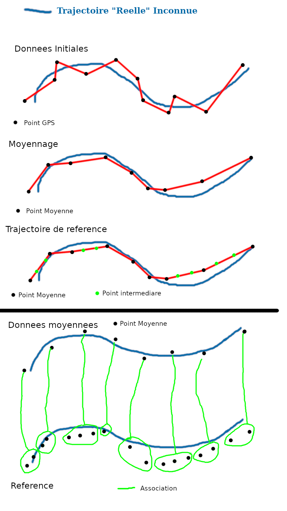

# Module de transformation des donnees

Ce dossier a pour but de normaliser les trajectoires fournies.

## Probleme

De nombreuses trajectoires ne sont pas coherentes avec la trajectoire voulue.
Les donnees sont bruitees.
Il est difficile de comparer les trajectoires si elles ne suivent pas un meme trace.

## Methodologie

En diminuant le nombre de points grace a un moyennage, on reduit tres fortement le bruit des donnees GPS.

On construit une trajectoire de reference, en ajoutant des points pour augmenter la distribution spatialle.

Puis, pour chaque trajectoire, on ramene les  points moyennes sur la trajectoire de reference, ce qui permet de mieux comparer les trajectoires entre elles.

## Realisation

Nous allons utiliser les donnees de la base de donnees Oxfam, presente sur le port 5500 en localhost. 
*Les donnees initiales, qui remplissaient les tables "Device", ne sont plus exposees afin de reduire la taille des images docker.*

Le moyennage se fera comme suit : le point n de la trajectoire moyennee est la moyenne des points n-2, n-1, n et n+1 et n+2 de la trajectoire GPS.

La trajectoire de reference sera la trajectoire moyennee du device 3883, qui realise le trajet prevu par l'organisation Oxfam.

Les trajectoires trop eloignees de la trajectoire de reference sont eliminees.